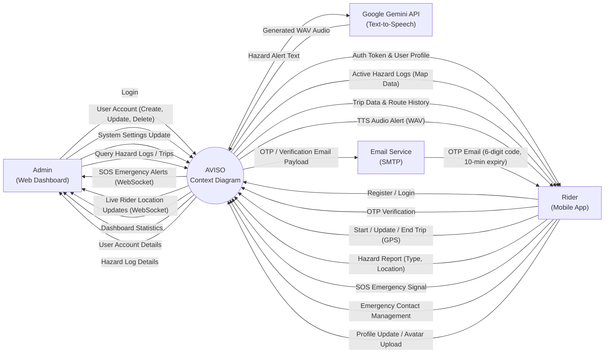

# 4.5.1 Context Diagram

```mermaid
graph LR
    Admin["Admin\n(Web Dashboard)"]
    Rider["Rider\n(Mobile App)"]
    Gemini["Google Gemini API\n(Text-to-Speech)"]
    Email["Email Service\n(SMTP)"]
    AVISO(("AVISO\nContext Diagram"))

    %% Admin → AVISO inputs
    Admin -->|"Login"| AVISO
    Admin -->|"User Account (Create, Update, Delete)"| AVISO
    Admin -->|"System Settings Update"| AVISO
    Admin -->|"Query Hazard Logs / Trips"| AVISO

    %% AVISO → Admin outputs
    AVISO -->|"SOS Emergency Alerts (WebSocket)"| Admin
    AVISO -->|"Live Rider Location Updates (WebSocket)"| Admin
    AVISO -->|"Dashboard Statistics"| Admin
    AVISO -->|"User Account Details"| Admin
    AVISO -->|"Hazard Log Details"| Admin

    %% Rider → AVISO inputs
    Rider -->|"Register / Login"| AVISO
    Rider -->|"OTP Verification"| AVISO
    Rider -->|"Start / Update / End Trip (GPS)"| AVISO
    Rider -->|"Hazard Report (Type, Location)"| AVISO
    Rider -->|"SOS Emergency Signal"| AVISO
    Rider -->|"Emergency Contact Management"| AVISO
    Rider -->|"Profile Update / Avatar Upload"| AVISO

    %% AVISO → Rider outputs
    AVISO -->|"Auth Token & User Profile"| Rider
    AVISO -->|"Active Hazard Logs (Map Data)"| Rider
    AVISO -->|"Trip Data & Route History"| Rider
    AVISO -->|"TTS Audio Alert (WAV)"| Rider

    %% AVISO ↔ Google Gemini API
    AVISO -->|"Hazard Alert Text"| Gemini
    Gemini -->|"Generated WAV Audio"| AVISO

    %% AVISO → Email Service → Rider
    AVISO -->|"OTP / Verification Email Payload"| Email
    Email -->|"OTP Email (6-digit code, 10-min expiry)"| Rider
```
