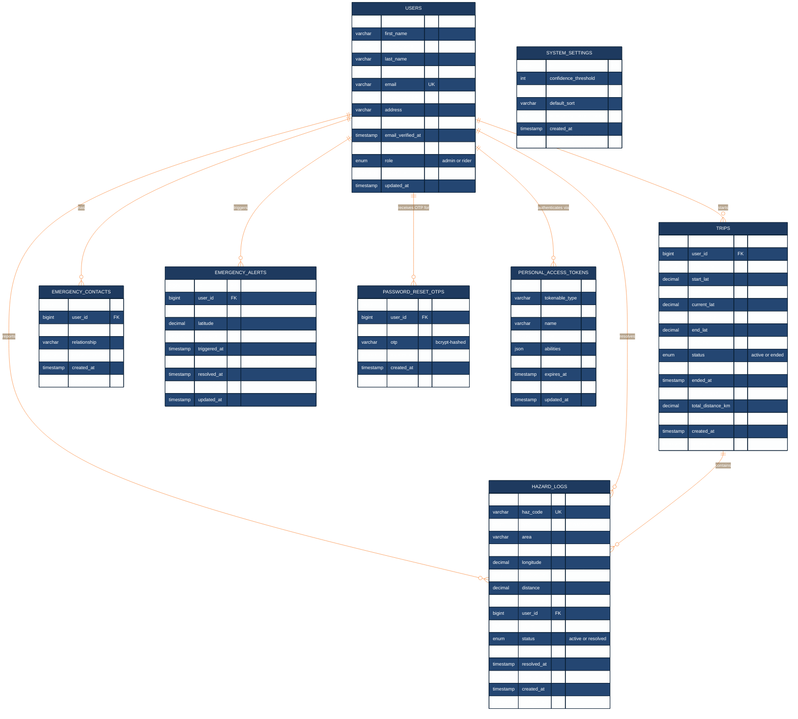

# 4.5.3 Entity-Relationship Diagram



---

## Normalization Analysis

### First Normal Form (1NF) ✓
All columns store atomic (single, indivisible) values. The two JSON columns are deliberate exceptions:
- `trips.route_points` — GPS waypoints stored as JSON for fast sequential writes during live tracking; normalizing into a separate table would require hundreds of inserts per trip
- `system_settings.emergency_hazard_types` — a configuration array with one row in the table; JSON is appropriate for a singleton config record

### Second Normal Form (2NF) ✓
All non-key attributes depend on the **entire** primary key. Every table uses a single-column surrogate `id` (BIGINT AUTO INCREMENT), so partial dependency is not possible.

### Third Normal Form (3NF) — with one intentional exception
No transitive dependencies exist, except:

| Column | Table | Transitive path | Why kept |
|---|---|---|---|
| `rider_code` | `trips` | `user_id → users.username` | Denormalized for fast real-time broadcast lookups without a join |
| `rider_code` | `hazard_logs` | `user_id → users.username` | Same reason — CV detection pipeline writes hazards at high frequency |
| `rider_code` | `emergency_alerts` | `user_id → users.username` | Kept for consistency with existing WebSocket event payloads |

These three columns are **intentional denormalizations** for performance, not design oversights. All three tables also carry the proper `user_id` FK, so referential integrity is maintained.

---

## Relationship Summary

| Relationship | Cardinality | Description |
|---|---|---|
| USERS → TRIPS | 1 to 0..* | A rider starts zero or many trips |
| USERS → HAZARD_LOGS (reports) | 1 to 0..* | A rider's CV device logs zero or many hazards |
| USERS → HAZARD_LOGS (resolves) | 1 to 0..* | An admin resolves zero or many hazards |
| USERS → EMERGENCY_CONTACTS | 1 to 0..* | A rider registers zero or many emergency contacts |
| USERS → EMERGENCY_ALERTS | 1 to 0..* | A rider triggers zero or many SOS alerts |
| USERS → PERSONAL_ACCESS_TOKENS | 1 to 0..* | A rider holds zero or many API tokens |
| USERS → PASSWORD_RESET_OTPS | 1 to 0..* | A user receives zero or many OTP records (deleted after use) |
| TRIPS → HAZARD_LOGS | 1 to 0..* | A trip contains zero or many hazard detections |

---

## PostgreSQL Schema (for drawSQL import)

Paste the block below at [drawsql.app](https://drawsql.app) → Import SQL → PostgreSQL.

```sql
CREATE TABLE users (
    id BIGSERIAL PRIMARY KEY,
    first_name VARCHAR(255) NOT NULL,
    middle_name VARCHAR(255),
    last_name VARCHAR(255) NOT NULL,
    username VARCHAR(255) UNIQUE NOT NULL,
    email VARCHAR(255) UNIQUE NOT NULL,
    contact_number VARCHAR(255),
    address VARCHAR(255),
    avatar_path VARCHAR(255),
    email_verified_at TIMESTAMP,
    password VARCHAR(255) NOT NULL,
    role VARCHAR(10) NOT NULL DEFAULT 'rider',
    remember_token VARCHAR(100),
    created_at TIMESTAMP,
    updated_at TIMESTAMP
);

CREATE TABLE trips (
    id BIGSERIAL PRIMARY KEY,
    user_id BIGINT REFERENCES users(id) ON DELETE SET NULL,
    rider_code VARCHAR(255) NOT NULL,
    start_lat DECIMAL(10,7) NOT NULL,
    start_lng DECIMAL(10,7) NOT NULL,
    current_lat DECIMAL(10,7) NOT NULL,
    current_lng DECIMAL(10,7) NOT NULL,
    end_lat DECIMAL(10,7),
    end_lng DECIMAL(10,7),
    status VARCHAR(10) NOT NULL DEFAULT 'active',
    started_at TIMESTAMP NOT NULL,
    ended_at TIMESTAMP,
    route_points JSONB,
    total_distance_km DECIMAL(8,3),
    duration_minutes INTEGER,
    created_at TIMESTAMP,
    updated_at TIMESTAMP
);

CREATE TABLE hazard_logs (
    id BIGSERIAL PRIMARY KEY,
    haz_code VARCHAR(255) UNIQUE NOT NULL,
    type VARCHAR(50) NOT NULL,
    area VARCHAR(255) NOT NULL,
    latitude DECIMAL(10,7) NOT NULL,
    longitude DECIMAL(10,7) NOT NULL,
    confidence DECIMAL(5,2) NOT NULL,
    distance DECIMAL(8,2),
    rider_code VARCHAR(255) NOT NULL,
    user_id BIGINT REFERENCES users(id) ON DELETE SET NULL,
    trip_id BIGINT REFERENCES trips(id) ON DELETE SET NULL,
    status VARCHAR(10) NOT NULL DEFAULT 'active',
    resolved_by BIGINT REFERENCES users(id) ON DELETE SET NULL,
    resolved_at TIMESTAMP,
    detected_at TIMESTAMP NOT NULL,
    created_at TIMESTAMP,
    updated_at TIMESTAMP
);

CREATE TABLE emergency_contacts (
    id BIGSERIAL PRIMARY KEY,
    user_id BIGINT NOT NULL REFERENCES users(id) ON DELETE CASCADE,
    name VARCHAR(255) NOT NULL,
    relationship VARCHAR(255),
    contact_number VARCHAR(255) NOT NULL,
    created_at TIMESTAMP,
    updated_at TIMESTAMP
);

CREATE TABLE emergency_alerts (
    id BIGSERIAL PRIMARY KEY,
    user_id BIGINT NOT NULL REFERENCES users(id) ON DELETE CASCADE,
    rider_code VARCHAR(255) NOT NULL,
    latitude DECIMAL(10,7) NOT NULL,
    longitude DECIMAL(10,7) NOT NULL,
    triggered_at TIMESTAMP NOT NULL,
    status VARCHAR(20) NOT NULL DEFAULT 'pending',
    resolved_at TIMESTAMP,
    created_at TIMESTAMP,
    updated_at TIMESTAMP
);

CREATE TABLE password_reset_otps (
    id BIGSERIAL PRIMARY KEY,
    user_id BIGINT REFERENCES users(id) ON DELETE CASCADE,
    email VARCHAR(255) NOT NULL,
    otp VARCHAR(255) NOT NULL,
    expires_at TIMESTAMP NOT NULL,
    created_at TIMESTAMP,
    updated_at TIMESTAMP
);

CREATE TABLE system_settings (
    id BIGSERIAL PRIMARY KEY,
    confidence_threshold INTEGER NOT NULL DEFAULT 0,
    items_per_page INTEGER NOT NULL DEFAULT 15,
    default_sort VARCHAR(255) NOT NULL DEFAULT 'detected_at',
    emergency_hazard_types JSONB,
    created_at TIMESTAMP,
    updated_at TIMESTAMP
);

CREATE TABLE personal_access_tokens (
    id BIGSERIAL PRIMARY KEY,
    tokenable_type VARCHAR(255) NOT NULL,
    tokenable_id BIGINT NOT NULL REFERENCES users(id) ON DELETE CASCADE,
    name TEXT NOT NULL,
    token VARCHAR(64) UNIQUE NOT NULL,
    abilities TEXT,
    last_used_at TIMESTAMP,
    expires_at TIMESTAMP,
    created_at TIMESTAMP,
    updated_at TIMESTAMP
);
```
