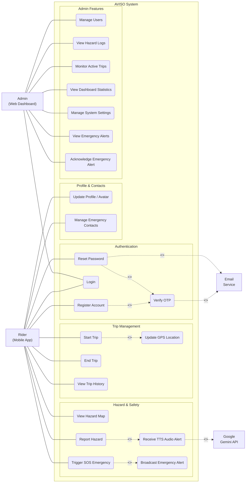

# 4.5.2 Use Case Diagram

```mermaid
flowchart LR
    Rider["Rider\n(Mobile App)"]
    Admin["Admin\n(Web Dashboard)"]
    Gemini["Google\nGemini API"]
    Email["Email\nService"]

    subgraph SYS["AVISO System"]
        direction TB

        subgraph AUTH["Authentication"]
            UC_REG("Register Account")
            UC_LOGIN("Login")
            UC_OTP("Verify OTP")
            UC_RESET("Reset Password")
        end

        subgraph TRIP["Trip Management"]
            UC_START("Start Trip")
            UC_GPS("Update GPS Location")
            UC_END("End Trip")
            UC_HIST("View Trip History")
        end

        subgraph HAZARD["Hazard & Safety"]
            UC_HMAP("View Hazard Map")
            UC_HREP("Report Hazard")
            UC_TTS("Receive TTS Audio Alert")
            UC_SOS("Trigger SOS Emergency")
            UC_BCAST("Broadcast Emergency Alert")
        end

        subgraph PROFILE["Profile & Contacts"]
            UC_PROF("Update Profile / Avatar")
            UC_EC("Manage Emergency Contacts")
        end

        subgraph ADMIN_UC["Admin Features"]
            UC_USERS("Manage Users")
            UC_HLOGS("View Hazard Logs")
            UC_TRIPS("Monitor Active Trips")
            UC_DASH("View Dashboard Statistics")
            UC_SET("Manage System Settings")
            UC_EMG("View Emergency Alerts")
            UC_ACK("Acknowledge Emergency Alert")
        end
    end

    %% Rider associations
    Rider --- UC_REG
    Rider --- UC_LOGIN
    Rider --- UC_RESET
    Rider --- UC_START
    Rider --- UC_END
    Rider --- UC_HIST
    Rider --- UC_HMAP
    Rider --- UC_HREP
    Rider --- UC_SOS
    Rider --- UC_PROF
    Rider --- UC_EC

    %% Admin associations
    Admin --- UC_LOGIN
    Admin --- UC_USERS
    Admin --- UC_HLOGS
    Admin --- UC_TRIPS
    Admin --- UC_DASH
    Admin --- UC_SET
    Admin --- UC_EMG
    Admin --- UC_ACK

    %% Include relationships
    UC_REG -. "<<include>>" .-> UC_OTP
    UC_RESET -. "<<include>>" .-> UC_OTP
    UC_START -. "<<include>>" .-> UC_GPS

    %% Extend relationships
    UC_HREP -. "<<extend>>" .-> UC_TTS
    UC_SOS -. "<<extend>>" .-> UC_BCAST

    %% External service connections
    UC_TTS -. "<<include>>" .-> Gemini
    UC_OTP -. "<<include>>" .-> Email
    UC_RESET -. "<<include>>" .-> Email
```
